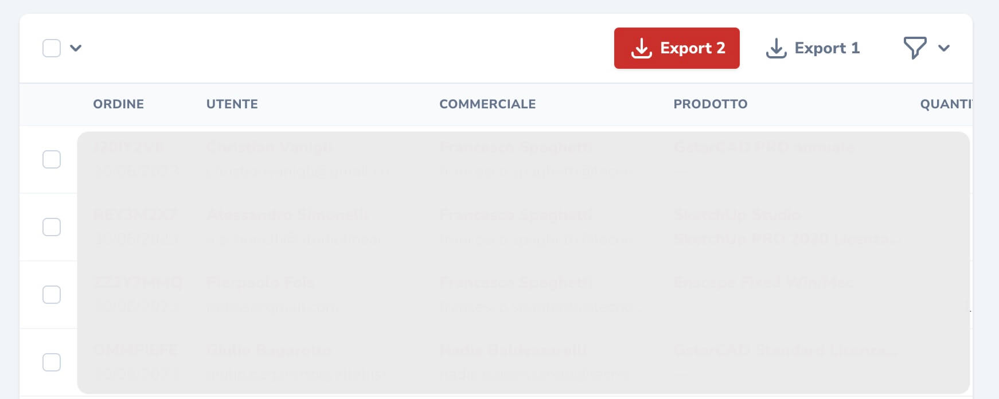
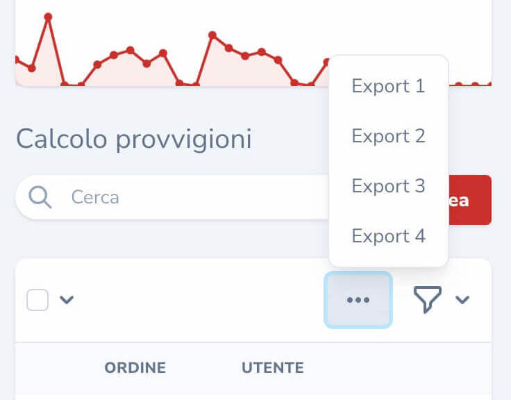

# Laravel Nova Detached Actions Tool

## Intro

A Laravel Nova tool to allow for placing actions in the Nova toolbar, detached from the checkbox selection mechanism.

:warning: Keep in mind, since the action is detached from the row selection checkboxes in the resource table, you will not have a collection of models to iterate over. Detached actions are intended to be independent of the selection in the table.

:warning: Also, keep in mind, pivot actions are not supported and have not been tested.



With mobile compatibility



## Installation

You can install the package in to a Laravel app that uses [Nova](https://nova.laravel.com) via composer:

```bash
composer require datomatic/nova-detached-actions
```

The tool will be automatically registered via the `ToolServiceProvider`

## Usage

Create a custom Nova Action file:

```bash
php artisan nova:action ExportUsers
```

Instead of extending the `ExportUsers` class with the `Laravel\Nova\Actions\Action` class, swap it with the `Datomatic\Nova\Tools\DetachedActions\DetachedAction` class.

Since we won't receive a collection of `$models`, you can remove the variable from the `handle` method, so that the signature is `public function handle(ActionFields $fields)`.

You can also customize the button name, by overriding the `name()` method. If you do not override the name, it will 'humanize' the class name, in the example `ExportUsers` would become `Export Users`.

By default, the detached action will only appear on the Index Toolbar.


Here's a full example:

```php
<?php

namespace App\Nova\Actions;

use Datomatic\Nova\Tools\DetachedActions\DetachedAction;
use Illuminate\Bus\Queueable;
use Illuminate\Queue\SerializesModels;
use Illuminate\Queue\InteractsWithQueue;
use Illuminate\Contracts\Queue\ShouldQueue;
use Laravel\Nova\Fields\ActionFields;

class ExportUsers extends DetachedAction
{
    use InteractsWithQueue, Queueable, SerializesModels;
    
    /**
     * Get the displayable label of the button.
     *
     * @return string
     */
    public function label()
    {
        return __('Export Users');
    }

    /**
     * Perform the action.
     *
     * @param  ActionFields  $fields
     *
     * @return mixed
     */
    public function handle(ActionFields $fields)
    {
        // Do work to export records

        return DetachedAction::message('It worked!');
    }

    /**
     * Get the fields available on the action.
     *
     * @return array
     */
    public function fields()
    {
        return [];
    }
}
```

Register the action on your resource:

```php
/**
 * Get the actions available for the resource.
 *
 * @param  \Illuminate\Http\Request  $request
 * @return array
 */
public function actions(Request $request)
{
    return [
        new App\Nova\Actions\ExportUsers
    ];
}
```

## Chunking and repetitive calls to the handle()
If you initiate an action on the background Nova will chunk up the total amount of records and call the `handle()` function of your DetachedAction for each chunk. This could have unexpected performance impact as the system will perform your action for each chunk of records.
This happens in the `handleRequest()` function of `\Laravel\Nova\Actions\Action.php`.

To prevent this the simplest way is to overrule this function in your `DetachedAction`. this is a bare example dispatching just a job without any checks or other logic:

```php
/** @return array<int,string> */
public function handleRequest(ActionRequest $request): array
{
    dispatch(new GenerateTicketReport($request->resolveFields()));
    return DetachedAction::message('Nice job!');
}
```

### Usage with the Laravel Nova Excel `DownloadExcel` action

You can easily integrate the `DetachedAction` tool with the [Laravel Nova Excel](https://github.com/Maatwebsite/Laravel-Nova-Excel) `DownloadExcel` action by simply passing some additional data along using `withMeta()`.

```php
/**
  * Get the actions available for the resource.
  *
  * @param  \Illuminate\Http\Request  $request
  * @return array
  */
 public function actions(Request $request)
 {
     return [
         (new DownloadExcel)->withHeadings()->askForWriterType()->withMeta([
             'detachedAction' => true,
             'label' => 'Export',
             'name' => 'Export',
             'showOnIndexToolbar' => true
         ])->confirmButtonText('Export'),
     ];
 }
 ```

### Customizing Buttons

### Visible vs Invisible Buttons

By default, the component will show the first 3 buttons and put the rest into a dropdown menu. If you want to change the number of buttons visible per resource, you can do so by using the `additionalInformation` method, like so:

```php
public static function additionalInformation(Request $request)
{
    return [
        'visibleActionsLimit' => 4
    ];
}
```


### Customizing Button Classes

The package ships with some common sense default HTML classes that are applied to the action buttons. In the component, we automatically assign the following:

```
hover:bg-gray-200 dark:hover:bg-gray-800 flex-shrink-0 rounded focus:outline-none focus:ring inline-flex items-center font-bold px-3 h-9 text-sm flex-shrink-0
```

A developer can add classes on the fly, using the `extraClasses()` method on the `DetachedAction` class.

### The `extraClasses()` method

You are free to use any tailwind/nova class.

```php
return [
   (new ImportUsers)->extraClasses('bg-logo text-white hover:black')
];
```
### The `$defaultClasses` variable

You can also extend `DetachedAction` class and change the default classes on `$defaultClasses` variable.

For example, you can add the classes to be equal to nova primary button

```
shadow ring-primary-200 dark:ring-gray-600 bg-primary-500 hover:bg-primary-400 active:bg-primary-600 text-white dark:text-gray-800
```


### Adding an icon

You can use any of the 104 Heroicon icons by specifying the icon name in lowercase:

```php
return [
   (new ImportUsers)->icon('add')
];
```

You can also customize the display of that icon using `iconClasses`:

```php
return [
   (new ImportUsers)->icon('upload')->iconClasses('mr-3 -ml-2')
];
```


## License

The MIT License (MIT). Please see [License File](LICENSE) for more information.


